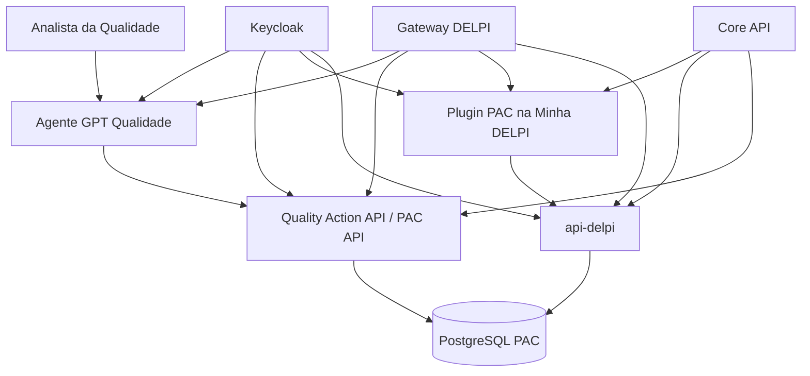
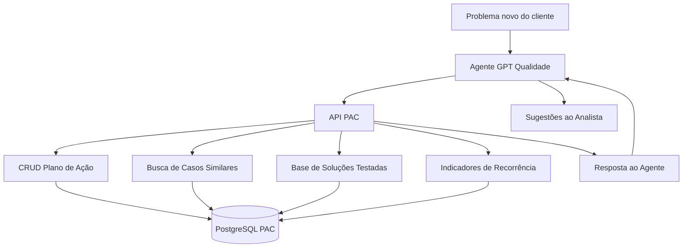
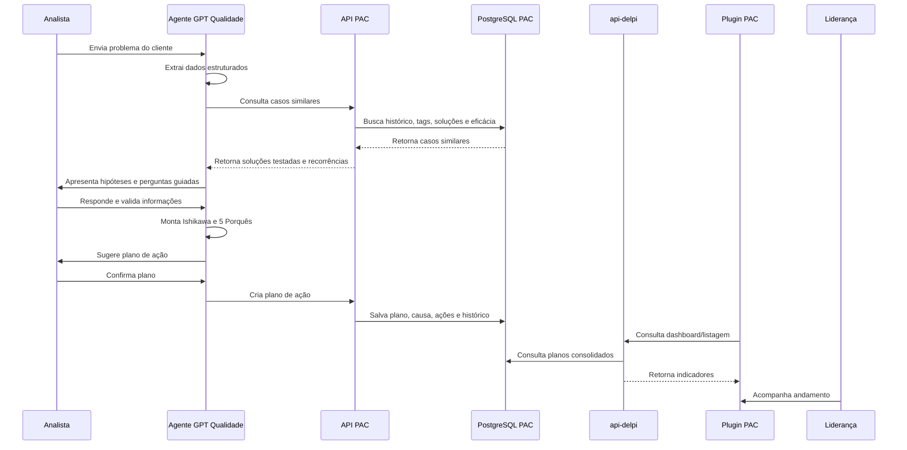
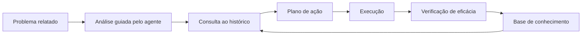

# Playbook e Roadmap — PAC Qualidade DELPI

**Projeto:** Plano de Ação Central de Qualidade DELPI  
**Produto:** PAC Qualidade DELPI  
**Versão do documento:** 0.1  
**Data:** 2026-06-24  
**Base de desenvolvimento:** DELPI Central, Minha DELPI, api-delpi, Minha DELPI AI API e ecossistema de plugins DELPI.

---

## 1. Contexto do projeto

A DELPI está enfrentando muitos problemas de qualidade nos produtos fabricados. Para organizar a tratativa, padronizar a análise de causa e dar visibilidade para a liderança, será criado um novo conjunto de ferramentas para acompanhamento central de planos de ação.

A solução será composta por:

1. **Um agente GPT especialista em qualidade**, Ishikawa e 5 Porquês.
2. **Uma API para o agente**, responsável por registrar planos de ação, consultar histórico e fornecer inteligência baseada em problemas e soluções anteriores.
3. **Um plugin na Minha DELPI**, para a liderança acompanhar todos os planos de ação e visualizar resumos executivos.
4. **Uma ampliação da api-delpi**, para entregar ao plugin consultas consolidadas dos planos de ação, indicadores e dados de acompanhamento.

A ideia central é que o analista da qualidade receba um problema de cliente, que pode vir por e-mail, mensagem, planilha, PDF, imagem ou texto livre, e use o agente GPT para estruturar a análise, levantar causa raiz e montar um plano de ação. Depois de validado pelo usuário, o plano será registrado via API e ficará disponível para acompanhamento pela liderança.

Além do CRUD tradicional, a API usada pelo agente deverá fornecer informações de outros problemas e soluções, aumentando a inteligência do agente para sugerir caminhos com base em soluções testadas, problemas recorrentes e histórico real da DELPI.

---

## 2. Objetivo do produto

Criar uma plataforma centralizada para:

- Registrar problemas de qualidade relatados por clientes ou áreas internas.
- Conduzir análise estruturada com ferramentas da qualidade.
- Apoiar o analista com um agente GPT especializado.
- Aplicar Ishikawa e 5 Porquês.
- Criar planos de ação rastreáveis.
- Registrar responsáveis, prazos, evidências e status.
- Consultar histórico de problemas semelhantes.
- Reaproveitar soluções testadas.
- Identificar recorrência de problemas.
- Acompanhar planos em andamento pela liderança.
- Medir eficácia das ações.
- Alimentar uma base de conhecimento operacional de qualidade.

---

## 3. Nome do produto e nomes técnicos recomendados

| Item | Nome recomendado |
|---|---|
| Produto | PAC Qualidade DELPI |
| Plugin | `quality-action-plans` |
| API transacional | `quality-action-api` |
| Agente | `quality-root-cause-agent` |
| Módulo na api-delpi | `quality/action-plans` |
| Permissão base do plugin | `quality-action-plans.access` |
| Permissão base da api-delpi | `api-delpi.quality.action-plans.read` |
| Camada de conhecimento | `Quality Action Knowledge Layer` |

---

## 4. Escopo macro

Serão criadas **3 ferramentas novas** e será ampliada **1 ferramenta existente**.

### 4.1 Ferramenta 1 — Agente GPT de Qualidade

Responsável por interagir com o analista e construir o plano de ação.

Funções principais:

- Receber problemas vindos de e-mail, mensagem, planilha, PDF, imagem ou texto livre.
- Extrair dados relevantes:
  - cliente;
  - contato;
  - produto;
  - lote;
  - data do relato;
  - sintoma;
  - impacto;
  - urgência;
  - evidências;
  - origem da reclamação.
- Conduzir investigação guiada.
- Aplicar Ishikawa.
- Aplicar 5 Porquês.
- Consultar problemas históricos semelhantes.
- Consultar soluções testadas.
- Sugerir hipóteses com base no histórico.
- Sugerir ações com base em soluções eficazes.
- Alertar quando existirem reincidências.
- Sugerir ações de contenção, corretivas, preventivas, verificação e padronização.
- Validar lacunas com o usuário antes de registrar.
- Gerar plano de ação em formato estruturado.
- Chamar a API PAC para criar ou atualizar registros.

O agente não deve tomar decisões finais sozinho. Ele deve apoiar o analista e sempre pedir confirmação antes de registrar ou concluir informações críticas.

---

### 4.2 Ferramenta 2 — API do Agente / API PAC

Responsável pelo ciclo de vida operacional do plano de ação e pela inteligência histórica.

Sugestão de nome:

```text
quality-action-api
```

Alternativa, caso se decida manter dentro da API de IA:

```text
minha-delpi-ai-api/app/quality_action/
```

Recomendação arquitetural inicial:

> Criar um backend dedicado para o domínio PAC, integrado ao agente e à api-delpi. O agente usa a API PAC para escrita e inteligência. O plugin consulta os dados consolidados por meio da api-delpi.

Responsabilidades transacionais:

- Criar plano de ação.
- Atualizar problema relatado.
- Registrar análise Ishikawa.
- Registrar 5 Porquês.
- Criar ações.
- Atualizar ações.
- Alterar status.
- Registrar responsáveis.
- Registrar prazos.
- Registrar evidências.
- Registrar histórico e auditoria.
- Validar JWT e permissões.
- Salvar em PostgreSQL.

Responsabilidades de inteligência histórica:

- Consultar casos similares.
- Consultar soluções testadas.
- Identificar recorrência.
- Sugerir causas prováveis.
- Sugerir ações que funcionaram.
- Alertar sobre ações que não foram eficazes.
- Medir taxa histórica de eficácia.
- Alimentar uma base de conhecimento de problemas e soluções.

---

### 4.3 Ferramenta 3 — Plugin Minha DELPI: Acompanhamento PAC

Plugin visual para liderança acompanhar todos os planos de ação.

Sugestão de id:

```text
quality-action-plans
```

Sugestão de nome no menu:

```text
Planos de Ação Qualidade
```

Responsabilidades:

- Dashboard executivo.
- Lista de planos de ação.
- Filtros por:
  - status;
  - cliente;
  - produto;
  - responsável;
  - setor;
  - criticidade;
  - prazo;
  - causa raiz;
  - modo de falha.
- Indicadores de atraso.
- Indicadores por causa raiz.
- Indicadores por tipo de problema.
- Indicadores por cliente.
- Indicadores por produto.
- Visão individual do plano.
- Linha do tempo.
- Visualização de ações e responsáveis.
- Visão de evidências.
- Exportação futura.
- Alertas visuais para atrasos e reincidências.

O plugin deve seguir o sistema oficial de manifesto da DELPI Central.

---

### 4.4 Ferramenta ampliada — api-delpi

A `api-delpi` será ampliada para entregar dados consolidados ao plugin.

Novo módulo sugerido:

```text
/apps/api-delpi/quality/action-plans/*
```

Responsabilidades:

- Entregar consultas consolidadas ao plugin.
- Expor dashboards resumidos.
- Aplicar RBAC por rota.
- Padronizar filtros e paginação.
- Registrar origem pelo header `X-Delpi-Caller-App`.
- Evitar que o plugin acesse diretamente o banco ou a API transacional.

A `api-delpi` deve funcionar como camada de leitura e agregação para a experiência visual do plugin.

---

## 5. Arquitetura proposta



---

## 6. Arquitetura com camada de conhecimento histórico

A API PAC não deve ser apenas uma API de CRUD. Ela deve se tornar a **memória técnica da qualidade da DELPI**.



Com isso, o agente não começa do zero a cada problema. Ele consulta o histórico real da DELPI antes de sugerir causas e ações.

---

## 7. Decisão arquitetural recomendada

Separar responsabilidades da seguinte forma:

| Camada | Responsabilidade |
|---|---|
| Agente GPT | Conversa, interpretação, análise orientada, Ishikawa, 5 Porquês e geração assistida do plano |
| API PAC | Escrita oficial do plano de ação, regras transacionais e inteligência histórica |
| api-delpi | Leitura consolidada para dashboards e plugin |
| Plugin PAC | Experiência visual da liderança |
| Core API | Registro do plugin, RBAC, rotas, permissões e auditoria central |
| Keycloak | Identidade e autenticação |
| Gateway | Entrada única, roteamento, HTTPS, CORS, headers de segurança e rate limit |

Essa separação evita colocar regra de negócio no frontend e mantém o plugin focado em apresentação.

---

## 8. Fluxo operacional completo



---

## 9. Como o agente usa a inteligência histórica

Quando o analista informar algo como:

> Cliente reclamou que o cabo rompeu durante o uso.

O agente deve chamar a API antes de sugerir qualquer plano:

```http
POST /quality/action-plans/intelligence/similar-cases
```

Payload:

```json
{
  "problemDescription": "Cabo rompeu durante o uso",
  "productCode": "010101",
  "customerName": "Cliente ABC",
  "batchNumber": "L2406",
  "symptoms": ["rompimento", "falha em uso", "isolação fragilizada"]
}
```

Resposta esperada:

```json
{
  "similarCases": [
    {
      "planId": "PAC-2026-0018",
      "similarityScore": 0.87,
      "productCode": "010098",
      "problemSummary": "Rompimento de cabo após montagem no cliente",
      "rootCause": "Ferramental de corte com desgaste acima do limite",
      "effectiveActions": [
        "Criada rotina preventiva de troca do ferramental",
        "Incluída inspeção dimensional por amostragem no setup",
        "Treinamento dos operadores no padrão de corte"
      ],
      "effectivenessStatus": "effective",
      "closedAt": "2026-05-14"
    }
  ],
  "recurrenceSignals": {
    "sameProduct": 2,
    "sameSymptom": 5,
    "sameRootCauseCategory": 3
  },
  "suggestedFocusAreas": [
    "Ferramental",
    "Método de inspeção",
    "Treinamento operacional"
  ]
}
```

A partir disso, o agente pode dizer:

> Encontrei casos parecidos envolvendo rompimento de cabo. Em um deles, a causa raiz foi desgaste de ferramental de corte e a ação eficaz foi criar rotina preventiva. Vamos validar se esse caminho faz sentido para este caso antes de concluir a causa?

Isso transforma o agente em um assistente de melhoria contínua baseado em histórico real.

---

## 10. Regra de ouro do agente

O agente **não deve afirmar que uma solução é correta apenas porque funcionou antes**.

Ele deve comunicar com cuidado:

```text
Encontrei casos similares onde esta ação foi eficaz. Vamos validar se as condições deste caso são equivalentes?
```

Regras obrigatórias:

- Não inventar causa raiz.
- Não concluir sem evidência suficiente.
- Não salvar plano sem confirmação explícita do analista.
- Marcar campos inferidos como sugestão ou `needs_confirmation`.
- Informar nível de confiança quando sugerir causa ou ação.
- Diferenciar fato, hipótese e sugestão.
- Registrar quais casos históricos embasaram a sugestão.

---

## 11. Modelo de domínio sugerido

### 11.1 Entidade principal: `quality_action_plans`

```text
id
code
title
customer_name
customer_contact
source_type
source_reference
product_code
product_description
batch_number
reported_problem
detected_at
reported_at
severity
status
created_by_user_id
owner_user_id
department
problem_category
symptom_tags
root_cause_category
failure_mode
effectiveness_status
effectiveness_verified_at
effectiveness_notes
recurrence_key
created_at
updated_at
closed_at
```

Exemplos de categorização:

```text
problem_category = "falha em campo"
symptom_tags = ["rompimento", "isolação", "uso cliente"]
root_cause_category = "processo"
failure_mode = "rompimento de cabo"
effectiveness_status = "effective"
recurrence_key = "produto:010101|falha:rompimento-cabo"
```

---

### 11.2 Status sugeridos do plano

```text
draft
triage
containment
root_cause_analysis
action_plan_defined
in_progress
waiting_validation
completed
cancelled
```

Descrição dos status:

| Status | Descrição |
|---|---|
| `draft` | Plano iniciado, ainda incompleto |
| `triage` | Problema em triagem inicial |
| `containment` | Ação de contenção em andamento |
| `root_cause_analysis` | Análise de causa em andamento |
| `action_plan_defined` | Plano definido e aguardando execução |
| `in_progress` | Ações em execução |
| `waiting_validation` | Aguardando verificação de eficácia |
| `completed` | Plano concluído |
| `cancelled` | Plano cancelado ou invalidado |

---

### 11.3 Severidade sugerida

```text
low
medium
high
critical
```

| Severidade | Descrição |
|---|---|
| `low` | Baixo impacto ou ocorrência isolada |
| `medium` | Impacto moderado, requer acompanhamento |
| `high` | Impacto relevante no cliente, produção ou qualidade |
| `critical` | Alto impacto, risco ao cliente, produção, segurança ou imagem |

---

### 11.4 Entidade: `quality_problem_evidences`

Para anexos, imagens, PDFs, e-mails, prints, planilhas e documentos.

```text
id
plan_id
type
file_name
file_url
text_excerpt
uploaded_by
created_at
```

Tipos possíveis:

```text
email
message
spreadsheet
pdf
image
manual_text
system_reference
other
```

---

### 11.5 Entidade: `quality_ishikawa_analysis`

```text
id
plan_id
method
machine
method_process
material
manpower
measurement
environment
notes
created_at
updated_at
```

Categorias do Ishikawa:

| Campo | Categoria |
|---|---|
| `machine` | Máquina |
| `method_process` | Método / Processo |
| `material` | Material |
| `manpower` | Mão de obra |
| `measurement` | Medição |
| `environment` | Meio ambiente |

---

### 11.6 Entidade: `quality_five_whys`

```text
id
plan_id
why_1
why_2
why_3
why_4
why_5
root_cause
confidence_level
created_at
updated_at
```

Níveis de confiança:

```text
low
medium
high
```

---

### 11.7 Entidade: `quality_actions`

```text
id
plan_id
action_type
description
responsible_user_id
responsible_name
department
due_date
status
evidence_required
completed_at
created_at
updated_at
```

Tipos de ação:

```text
containment
corrective
preventive
verification
standardization
training
```

Status da ação:

```text
pending
in_progress
blocked
completed
cancelled
overdue
```

---

### 11.8 Entidade: `quality_action_history`

```text
id
plan_id
event_type
old_value
new_value
comment
created_by
created_at
```

Eventos possíveis:

```text
plan_created
plan_updated
status_changed
action_created
action_updated
action_completed
ishikawa_updated
five_whys_updated
effectiveness_reviewed
plan_closed
plan_reopened
```

---

### 11.9 Entidade: `quality_solution_patterns`

Tabela que consolida soluções testadas e reutilizáveis.

```text
id
title
problem_category
failure_mode
root_cause_category
symptom_tags
recommended_actions
actions_to_avoid
evidence_summary
effectiveness_rate
usage_count
last_used_at
created_from_plan_id
created_at
updated_at
```

Exemplo:

```json
{
  "title": "Rompimento de cabo por desgaste de ferramental",
  "problemCategory": "falha em campo",
  "failureMode": "rompimento de cabo",
  "rootCauseCategory": "processo",
  "symptomTags": ["rompimento", "corte", "isolação"],
  "recommendedActions": [
    "Verificar condição do ferramental de corte",
    "Criar rotina preventiva de troca",
    "Registrar setup com inspeção dimensional",
    "Treinar operadores no padrão revisado"
  ],
  "actionsToAvoid": [
    "Trocar fornecedor sem evidência de falha de material",
    "Encerrar caso sem verificação de eficácia"
  ],
  "effectivenessRate": 0.82,
  "usageCount": 6
}
```

---

### 11.10 Entidade: `quality_case_similarity_index`

Pode começar simples em PostgreSQL com busca textual, tags e filtros. Depois pode evoluir para embeddings.

```text
id
plan_id
search_text
product_code
customer_name
problem_category
failure_mode
root_cause_category
symptom_tags
embedding_vector
created_at
updated_at
```

No MVP, a busca pode usar:

- `search_text`;
- `symptom_tags`;
- `failure_mode`;
- `root_cause_category`;
- `product_code`;
- busca textual e ranking simples.

Evolução futura:

- `pgvector`;
- embeddings;
- busca semântica;
- ranking híbrido;
- combinação de similaridade vetorial + filtros estruturados.

---

## 12. Contratos de API sugeridos

## 12.1 API PAC — escrita e ciclo de vida

Base sugerida:

```text
/apps/quality-action-api
```

Alternativa, se embutida na IA:

```text
/apps/minha-delpi-ai/api/quality/action-plans
```

---

### Criar plano

```http
POST /quality/action-plans
Authorization: Bearer <token>
Content-Type: application/json
```

Payload:

```json
{
  "title": "Cliente reclama de falha no cabo X",
  "customerName": "Cliente ABC",
  "productCode": "010101",
  "batchNumber": "L2406",
  "reportedProblem": "Produto apresentou rompimento no uso",
  "sourceType": "email",
  "severity": "high"
}
```

Resposta:

```json
{
  "id": "uuid",
  "code": "PAC-2026-0001",
  "status": "triage",
  "message": "Plano de ação criado com sucesso"
}
```

---

### Atualizar análise Ishikawa

```http
PUT /quality/action-plans/{id}/ishikawa
Authorization: Bearer <token>
Content-Type: application/json
```

Payload:

```json
{
  "machine": "Possível desgaste em ferramenta de corte",
  "methodProcess": "Sequência de inspeção não bloqueia lote suspeito",
  "material": "Matéria-prima com variação dimensional",
  "manpower": "Operador novo sem treinamento específico",
  "measurement": "Instrumento sem evidência recente de calibração",
  "environment": "Umidade elevada no período",
  "notes": "Hipóteses levantadas durante análise com o agente"
}
```

---

### Atualizar 5 Porquês

```http
PUT /quality/action-plans/{id}/five-whys
Authorization: Bearer <token>
Content-Type: application/json
```

Payload:

```json
{
  "why1": "Porque o cabo rompeu durante o uso",
  "why2": "Porque a isolação estava fragilizada",
  "why3": "Porque houve variação no processo de corte",
  "why4": "Porque a ferramenta estava fora da condição ideal",
  "why5": "Porque não havia rotina preventiva definida para esse ferramental",
  "rootCause": "Ausência de rotina preventiva formal para controle do ferramental crítico",
  "confidenceLevel": "medium"
}
```

---

### Criar ações

```http
POST /quality/action-plans/{id}/actions
Authorization: Bearer <token>
Content-Type: application/json
```

Payload:

```json
{
  "actions": [
    {
      "actionType": "containment",
      "description": "Bloquear lote L2406 até inspeção 100%",
      "responsibleName": "Analista Qualidade",
      "department": "Qualidade",
      "dueDate": "2026-06-27"
    },
    {
      "actionType": "corrective",
      "description": "Criar rotina preventiva para troca/verificação do ferramental",
      "responsibleName": "Engenharia de Processo",
      "department": "Engenharia",
      "dueDate": "2026-07-05"
    }
  ]
}
```

---

### Registrar eficácia

Esse endpoint é essencial. Sem medir eficácia, a base aprende errado.

```http
POST /quality/action-plans/{id}/effectiveness-review
Authorization: Bearer <token>
Content-Type: application/json
```

Payload:

```json
{
  "effectivenessStatus": "effective",
  "verifiedBy": "user-id",
  "notes": "Após 60 dias não houve reincidência no cliente nem no produto.",
  "recurrenceObserved": false
}
```

Status possíveis:

```text
pending
effective
partially_effective
ineffective
not_verified
```

---

## 12.2 API PAC — endpoints de inteligência

### Buscar casos similares

```http
POST /quality/action-plans/intelligence/similar-cases
Authorization: Bearer <token>
Content-Type: application/json
```

Uso: o agente consulta antes de sugerir causa e ações.

Payload:

```json
{
  "problemDescription": "Cabo rompeu durante o uso",
  "productCode": "010101",
  "customerName": "Cliente ABC",
  "batchNumber": "L2406",
  "symptoms": ["rompimento", "falha em uso", "isolação fragilizada"]
}
```

Resposta:

```json
{
  "similarCases": [
    {
      "planId": "PAC-2026-0018",
      "similarityScore": 0.87,
      "productCode": "010098",
      "problemSummary": "Rompimento de cabo após montagem no cliente",
      "rootCause": "Ferramental de corte com desgaste acima do limite",
      "effectiveActions": [
        "Criada rotina preventiva de troca do ferramental",
        "Incluída inspeção dimensional por amostragem no setup",
        "Treinamento dos operadores no padrão de corte"
      ],
      "effectivenessStatus": "effective",
      "closedAt": "2026-05-14"
    }
  ],
  "recurrenceSignals": {
    "sameProduct": 2,
    "sameSymptom": 5,
    "sameRootCauseCategory": 3
  },
  "suggestedFocusAreas": [
    "Ferramental",
    "Método de inspeção",
    "Treinamento operacional"
  ]
}
```

---

### Buscar soluções testadas

```http
POST /quality/action-plans/intelligence/solution-patterns/search
Authorization: Bearer <token>
Content-Type: application/json
```

Payload:

```json
{
  "problemCategory": "falha em campo",
  "failureMode": "rompimento de cabo",
  "rootCauseCategory": "processo",
  "symptomTags": ["rompimento", "isolação"]
}
```

Resposta:

```json
{
  "patterns": [
    {
      "id": "pattern-uuid",
      "title": "Rompimento de cabo por desgaste de ferramental",
      "effectivenessRate": 0.82,
      "usageCount": 6,
      "recommendedActions": [
        "Verificar condição do ferramental de corte",
        "Criar rotina preventiva de troca",
        "Registrar setup com inspeção dimensional"
      ],
      "actionsToAvoid": [
        "Trocar fornecedor sem evidência de falha de material"
      ]
    }
  ]
}
```

---

### Sugerir ações com base histórica

```http
POST /quality/action-plans/intelligence/suggest-actions
Authorization: Bearer <token>
Content-Type: application/json
```

Payload:

```json
{
  "problemDescription": "Cabo rompeu durante o uso",
  "problemCategory": "falha em campo",
  "failureMode": "rompimento de cabo",
  "rootCauseCategory": "processo",
  "symptomTags": ["rompimento", "isolação"]
}
```

Resposta:

```json
{
  "suggestions": [
    {
      "actionType": "corrective",
      "description": "Criar rotina preventiva de verificação do ferramental de corte",
      "basedOnCases": ["PAC-2026-0018", "PAC-2026-0041"],
      "historicalEffectiveness": 0.82,
      "confidence": "high"
    }
  ],
  "warnings": [
    "Existem 3 casos parecidos em que a ação foi encerrada sem verificação de eficácia."
  ]
}
```

---

## 12.3 api-delpi — leitura para plugin

Base:

```text
/apps/api-delpi/quality/action-plans
```

---

### Listagem

```http
GET /quality/action-plans?status=in_progress&severity=high&page=1&pageSize=20
Authorization: Bearer <token>
X-Delpi-Caller-App: quality-action-plans
```

Resposta sugerida:

```json
{
  "items": [
    {
      "id": "uuid",
      "code": "PAC-2026-0001",
      "title": "Cliente reclama de falha no cabo X",
      "customerName": "Cliente ABC",
      "productCode": "010101",
      "severity": "high",
      "status": "in_progress",
      "ownerName": "Analista Qualidade",
      "dueDate": "2026-07-05",
      "isOverdue": false
    }
  ],
  "page": 1,
  "pageSize": 20,
  "total": 42
}
```

---

### Dashboard

```http
GET /quality/action-plans/dashboard
Authorization: Bearer <token>
X-Delpi-Caller-App: quality-action-plans
```

Resposta sugerida:

```json
{
  "total": 42,
  "open": 31,
  "overdue": 8,
  "completedThisMonth": 11,
  "criticalOpen": 4,
  "averageDaysToClose": 12.4,
  "byStatus": [
    { "status": "in_progress", "count": 14 },
    { "status": "waiting_validation", "count": 5 }
  ],
  "byRootCauseCategory": [
    { "category": "processo", "count": 9 },
    { "category": "material", "count": 6 }
  ]
}
```

---

### Detalhe

```http
GET /quality/action-plans/{id}
Authorization: Bearer <token>
X-Delpi-Caller-App: quality-action-plans
```

---

### Atrasados

```http
GET /quality/action-plans/overdue
Authorization: Bearer <token>
X-Delpi-Caller-App: quality-action-plans
```

---

## 13. Permissões RBAC sugeridas

Seguir padrão:

```text
module.resource.action
```

Permissões do plugin:

```text
quality-action-plans.access
quality-action-plans.view
quality-action-plans.create
quality-action-plans.update
quality-action-plans.close
quality-action-plans.admin
```

Permissões da api-delpi:

```text
api-delpi.quality.action-plans.read
api-delpi.quality.action-plans.dashboard
api-delpi.quality.action-plans.export
```

Perfis sugeridos:

| Perfil | Permissões |
|---|---|
| Analista Qualidade | criar, editar, anexar evidências, atualizar causa e ações |
| Líder Qualidade | visualizar tudo, reabrir, aprovar encerramento |
| Liderança Industrial | dashboard, detalhes e atrasos |
| Admin | gestão total e parametrizações |

---

## 14. Manifesto inicial do plugin

Arquivo sugerido:

```text
plugins/quality-action-plans/delpi.manifest.json
```

Conteúdo inicial:

```json
{
  "schemaVersion": "2.0.0",
  "id": "quality-action-plans",
  "name": "Planos de Ação Qualidade",
  "description": "Acompanhamento centralizado de planos de ação de qualidade",
  "version": "0.1.0",
  "category": "qualidade",
  "icon": "clipboard-check",
  "type": "microfrontend",
  "basePath": "/apps/quality-action-plans",
  "entry": "/apps/quality-action-plans/assets/remoteEntry.js",
  "healthcheck": "/apps/quality-action-plans/health",
  "dependencies": [],
  "permissions": [
    {
      "code": "quality-action-plans.access",
      "description": "Permite acessar o plugin de planos de ação de qualidade",
      "module": "quality-action-plans"
    },
    {
      "code": "quality-action-plans.view",
      "description": "Visualizar planos de ação de qualidade",
      "module": "quality-action-plans"
    },
    {
      "code": "quality-action-plans.admin",
      "description": "Administrar planos de ação de qualidade",
      "module": "quality-action-plans"
    }
  ],
  "routes": [
    {
      "path": "/apps/quality-action-plans",
      "label": "Planos de Ação",
      "icon": "clipboard-check",
      "permission": "quality-action-plans.access",
      "showInMenu": true,
      "order": 1,
      "menuGroup": "Qualidade"
    },
    {
      "path": "/apps/quality-action-plans/dashboard",
      "label": "Resumo Executivo",
      "icon": "layout-dashboard",
      "permission": "quality-action-plans.view",
      "showInMenu": true,
      "order": 2,
      "menuGroup": "Qualidade"
    }
  ],
  "backend": {
    "required": true,
    "serviceName": "api-delpi",
    "baseUrl": "/apps/api-delpi/quality/action-plans",
    "validateJwt": true,
    "audience": "delpi-central",
    "issuer": "https://central.delpi.com.br/auth",
    "requiredPermissionsHeader": "x-user-permissions"
  },
  "features": {
    "enableFeatureFlags": true,
    "exposeMetrics": true,
    "supportsMultiTenant": false
  },
  "lifecycle": {
    "autoRegisterPermissions": true,
    "autoCreateRoutes": true,
    "allowVersionUpgrade": true,
    "allowHotReload": false
  },
  "security": {
    "contentSecurityPolicy": true,
    "allowIframeEmbedding": false,
    "requireHttps": true
  },
  "observability": {
    "healthEndpoint": "/health",
    "metricsEndpoint": "/metrics",
    "logFormat": "json"
  },
  "ui": {
    "displayInAppLauncher": true,
    "launcherOrder": 20,
    "badge": null
  },
  "metadata": {
    "author": "Equipe DELPI",
    "repository": "delpi-central/plugins/quality-action-plans",
    "documentationUrl": "/docs/quality-action-plans",
    "supportEmail": "ti@delpi.com.br"
  }
}
```

---

## 15. Roadmap por fases

### Fase 0 — Descoberta e contrato funcional

**Objetivo:** fechar escopo mínimo, vocabulário e fluxo padrão.

Entregáveis:

- Glossário do domínio:
  - problema de cliente;
  - reclamação;
  - não conformidade;
  - contenção;
  - causa raiz;
  - ação corretiva;
  - ação preventiva;
  - verificação de eficácia.
- Mapa do fluxo atual da qualidade.
- Definição dos status oficiais.
- Definição dos responsáveis por etapa.
- Definição do MVP.
- ADR da arquitetura: API PAC separada versus módulo dentro da IA.
- Especificação inicial dos contratos HTTP.

Critério de aceite:

- Um caso real de problema de cliente consegue ser representado de ponta a ponta no modelo proposto.

---

### Fase 1 — Banco, domínio e API PAC

**Objetivo:** criar a base transacional do plano de ação.

Entregáveis:

- Migrations Alembic.
- Entidades de domínio.
- Use cases:
  - criar plano;
  - atualizar problema;
  - registrar Ishikawa;
  - registrar 5 Porquês;
  - criar ações;
  - atualizar status;
  - concluir plano;
  - listar histórico.
- Endpoints REST.
- Testes unitários da camada de aplicação.
- Testes de integração com PostgreSQL.
- Logs estruturados.
- Auditoria mínima.

Critério de aceite:

- Criar e atualizar um plano completo via API, sem uso do agente.

---

### Fase 2 — Knowledge Layer de problemas e soluções

**Objetivo:** transformar a API PAC em uma base de conhecimento operacional de qualidade.

Entregáveis:

- Campos de categorização no plano.
- Cadastro de tags de sintomas.
- Registro de modo de falha.
- Registro de categoria de causa raiz.
- Registro de eficácia.
- Tabela `quality_solution_patterns`.
- Tabela `quality_case_similarity_index`.
- Endpoint de casos similares.
- Endpoint de soluções testadas.
- Endpoint de sugestão de ações.
- Ranking simples por similaridade.
- Preparação futura para embeddings/pgvector.

Critério de aceite:

- Dado um novo problema, a API retorna casos parecidos e ações que já foram eficazes.

---

### Fase 3 — Agente GPT usando histórico

**Objetivo:** permitir que o analista construa o plano assistido pelo GPT e com apoio do histórico real da DELPI.

Entregáveis:

- Agente `quality-root-cause-agent`.
- Prompt/policy do agente com:
  - papel;
  - limites;
  - perguntas obrigatórias;
  - fluxo de investigação;
  - formato de saída;
  - critérios para não inventar informação;
  - regras de uso do histórico.
- Ferramenta interna para chamar API PAC.
- Interpretação de anexos já suportados pela plataforma de IA.
- Fluxo conversacional:
  1. entender problema;
  2. extrair dados;
  3. consultar casos similares;
  4. consultar soluções testadas;
  5. mostrar referências resumidas ao analista;
  6. levantar hipóteses;
  7. montar Ishikawa;
  8. conduzir 5 Porquês;
  9. sugerir ações;
  10. revisar com usuário;
  11. registrar plano.
- Testes com casos reais anonimizados.

Critério de aceite:

- O analista consegue sair de um relato livre para um plano cadastrado com causa raiz, ações e referências históricas quando existirem casos similares.

---

### Fase 4 — Ampliação da api-delpi

**Objetivo:** entregar dados consolidados ao plugin de liderança.

Entregáveis:

- Router `quality/action-plans`.
- Endpoint de listagem.
- Endpoint de detalhe.
- Endpoint de dashboard.
- Endpoint de atrasados.
- Endpoint de indicadores por:
  - causa;
  - cliente;
  - produto;
  - responsável;
  - status;
  - severidade;
  - modo de falha;
  - eficácia.
- Decorators RBAC.
- Header `X-Delpi-Caller-App`.
- Documentação em `api-delpi/docs/api/`.
- Testes de contrato.

Critério de aceite:

- O plugin consegue consumir dados somente pela `api-delpi`, sem acessar diretamente banco nem API interna transacional.

---

### Fase 5 — Plugin PAC na Minha DELPI

**Objetivo:** disponibilizar a visão executiva para liderança.

Entregáveis:

- Pasta `plugins/quality-action-plans`.
- `delpi.manifest.json`.
- Microfrontend React/Vite.
- HTTP client com:

```text
X-Delpi-Caller-App = quality-action-plans
```

- Telas:
  - Dashboard executivo;
  - Lista de planos;
  - Detalhe do plano;
  - Ações atrasadas;
  - Filtros;
  - Linha do tempo;
  - Indicadores de recorrência;
  - Indicadores de eficácia.
- Build via Vite/Module Federation.
- Registro na Core API.
- Smoke HTTP do `remoteEntry.js`.

Critério de aceite:

- Liderança acessa o plugin pelo menu dinâmico da Delpi Central e visualiza planos conforme RBAC.

---

### Fase 6 — Homologação operacional

**Objetivo:** validar com qualidade e liderança.

Cenários mínimos:

1. Reclamação simples criada manualmente.
2. Reclamação criada com auxílio do agente.
3. Reclamação com PDF ou imagem.
4. Plano com ação atrasada.
5. Plano concluído.
6. Plano reaberto.
7. Usuário sem permissão tentando acessar.
8. Liderança visualizando somente dashboard.
9. Analista editando ações.
10. Auditoria de alteração crítica.
11. Agente consultando caso similar.
12. Agente sugerindo solução baseada em caso eficaz.
13. Agente alertando ação anterior ineficaz.
14. Registro de verificação de eficácia.
15. Plano concluído alimentando a base de padrões.

Critério de aceite:

- Nenhum fluxo crítico quebra RBAC, auditoria ou rastreabilidade.

---

### Fase 7 — Produção assistida

**Objetivo:** colocar em uso controlado.

Entregáveis:

- Deploy em ambiente de produção.
- Registro oficial do manifesto.
- Checklist de rollback.
- Monitoramento de erros.
- Treinamento rápido dos analistas.
- Canal de feedback.
- Revisão semanal dos primeiros planos cadastrados.

Critério de aceite:

- Primeiros planos reais cadastrados, acompanhados pela liderança e usados para alimentar a base histórica.

---

### Fase 8 — Evoluções futuras

Itens futuros:

- Notificações automáticas de ações vencendo.
- E-mails de cobrança para responsáveis.
- Integração com NC/TOTVS, se existir base formal.
- Indicador de reincidência por produto.
- Indicador de causa raiz recorrente.
- Sugestão automática de ações com base em planos anteriores.
- Biblioteca de lições aprendidas.
- Exportação Excel/PDF.
- Aprovação formal de eficácia.
- Busca semântica com embeddings.
- Ranking híbrido de similaridade.
- Recomendação baseada em eficácia histórica.
- Alertas de problema recorrente.
- Curadoria de padrões de solução.

---

## 16. MVP recomendado

### MVP 1 — Plano manual + dashboard

- Banco PAC.
- API PAC CRUD.
- api-delpi leitura.
- Plugin com dashboard/listagem/detalhe.
- Sem agente ainda.

Resultado:

- Liderança já acompanha planos centralizados.

---

### MVP 2 — Busca histórica simples

- Mesmo produto.
- Mesma categoria de problema.
- Mesmas tags.
- Mesma causa raiz.
- Ações eficazes.

Resultado:

- A API começa a devolver problemas semelhantes e soluções testadas.

---

### MVP 3 — Agente assistente usando histórico

- Agente recebe relato.
- Consulta casos similares.
- Monta Ishikawa.
- Monta 5 Porquês.
- Sugere ações com base no histórico.
- Salva via API PAC.

Resultado:

- Analista ganha produtividade, padronização e apoio baseado em experiência real da DELPI.

---

### MVP 4 — Anexos e evidências

- PDF.
- Imagens.
- E-mails.
- Planilhas.
- Evidências por ação.

Resultado:

- Plano completo e auditável.

---

### MVP 5 — Inteligência executiva

- Reincidência.
- Causa raiz recorrente.
- Atrasos por área.
- Ranking por cliente/produto.
- Eficácia.
- Soluções mais usadas.
- Soluções mais eficazes.

Resultado:

- Gestão de qualidade baseada em dados.

---

### MVP 6 — Busca semântica com embeddings

- `pgvector`.
- Embeddings de problema, causa e ações.
- Busca semântica.
- Ranking híbrido.

Resultado:

- O agente encontra casos similares mesmo quando os textos são diferentes.

---

## 17. Estrutura sugerida no repositório

```text
delpi-central/
  plugins/
    quality-action-plans/
      delpi.manifest.json
      package.json
      src/
        ui/
        state/
        data/
        domain/
      docs/
        ROADMAP.md
        DOCUMENTACAO.md

  api-delpi/
    app/
      routers/
        quality_action_plans.py
      services/
        quality_action_plan_service.py
      schemas/
        quality_action_plans.py
      repositories/
        quality_action_plan_repository.py
    docs/
      api/
        quality-action-plans.md
    tests/
      test_quality_action_plans.py

  quality-action-api/
    app/
      domain/
      application/
      interfaces/
      infrastructure/
      composition/
    migrations/
    tests/
    docs/
      README.md
      api.md
      architecture.md

  minha-delpi-ai-api/
    app/
      domain/
        prompt_policies/
          quality_root_cause_agent.md
      application/
        services/
          quality_action_agent_service.py
      infrastructure/
        gateways/
          quality_action_api_gateway.py
    docs/
      roadmap/
        playbook-quality-action-agent.md
      knowledge/
        domains/
          agents/
            quality-root-cause/
```

---

## 18. Fluxo do agente GPT

O fluxo do agente passa a ser:

1. Receber problema.
2. Extrair dados estruturados.
3. Consultar casos similares.
4. Consultar soluções testadas.
5. Mostrar referências resumidas ao analista.
6. Conduzir Ishikawa.
7. Conduzir 5 Porquês.
8. Sugerir plano com base em:
   - análise atual;
   - histórico DELPI;
   - soluções eficazes;
   - recorrência;
   - criticidade.
9. Pedir confirmação.
10. Registrar plano.
11. Após conclusão, solicitar verificação de eficácia.
12. Alimentar base de padrões.

---

## 19. Indicadores para o plugin da liderança

O plugin deve mostrar:

- Total de planos.
- Planos abertos.
- Planos atrasados.
- Planos críticos abertos.
- Planos concluídos no mês.
- Tempo médio de fechamento.
- Tempo médio até verificação de eficácia.
- Ações atrasadas por área.
- Problemas recorrentes.
- Causas raiz mais frequentes.
- Ações mais eficazes.
- Ações com baixa eficácia.
- Produtos com maior reincidência.
- Clientes com mais reclamações.
- Responsáveis com mais ações em atraso.
- Modo de falha mais frequente.
- Categoria de problema mais frequente.
- Taxa de eficácia por tipo de ação.

---

## 20. Telas sugeridas para o plugin

### 20.1 Dashboard executivo

Cards:

- Planos abertos.
- Atrasados.
- Críticos.
- Concluídos no mês.
- Aguardando validação.
- Reincidências detectadas.

Gráficos:

- Planos por status.
- Planos por severidade.
- Planos por causa raiz.
- Planos por produto.
- Atrasos por departamento.
- Eficácia por tipo de ação.

---

### 20.2 Lista de planos

Colunas:

- Código.
- Título.
- Cliente.
- Produto.
- Severidade.
- Status.
- Responsável.
- Prazo.
- Atrasado.
- Eficácia.

Filtros:

- Status.
- Severidade.
- Cliente.
- Produto.
- Responsável.
- Departamento.
- Causa raiz.
- Modo de falha.
- Atrasado.

---

### 20.3 Detalhe do plano

Seções:

- Dados do problema.
- Evidências.
- Ishikawa.
- 5 Porquês.
- Causa raiz.
- Ações.
- Histórico.
- Casos similares usados pelo agente.
- Verificação de eficácia.

---

### 20.4 Visão de recorrência

Listas:

- Problemas recorrentes.
- Produtos com reincidência.
- Clientes com reincidência.
- Modos de falha repetidos.
- Causas raiz recorrentes.

---

### 20.5 Visão de soluções testadas

Listas:

- Soluções mais eficazes.
- Soluções mais usadas.
- Soluções parcialmente eficazes.
- Soluções ineficazes.
- Ações que devem ser evitadas.

---

## 21. Decisões arquiteturais a registrar

### ADR 1 — API PAC como API transacional e base de conhecimento

Título:

```text
ADR — API PAC também será base de conhecimento histórico de qualidade
```

Decisão:

> A API PAC será responsável não apenas pelo CRUD de planos de ação, mas também por consolidar dados históricos de problemas, causas, ações e eficácia, expondo endpoints de inteligência para o agente GPT sugerir tratativas com base em soluções reais já testadas na DELPI.

Consequências positivas:

- Agente mais útil.
- Reaproveitamento de conhecimento interno.
- Redução de reincidência.
- Decisões mais padronizadas.
- Melhoria contínua baseada em evidência.

Cuidados:

- Exige boa classificação dos problemas.
- Exige revisão de eficácia.
- Exige evitar sugestões automáticas sem validação humana.
- Exige rastreabilidade das sugestões.

---

### ADR 2 — Plugin consome api-delpi, não API PAC diretamente

Decisão:

> O plugin `quality-action-plans` consumirá a `api-delpi` para leituras e dashboards. A API PAC permanecerá como camada transacional e de inteligência para escrita, histórico e uso pelo agente.

Consequências positivas:

- Mantém padrão dos plugins DELPI.
- Centraliza leitura operacional na api-delpi.
- Evita acoplamento entre frontend e API transacional.
- Facilita controle de RBAC e rastreamento pelo header `X-Delpi-Caller-App`.

---

### ADR 3 — Agente não decide sem validação humana

Decisão:

> O agente GPT pode sugerir causas, ações e caminhos com base no histórico, mas não deve concluir causa raiz nem registrar plano sem confirmação explícita do analista.

Consequências positivas:

- Reduz risco de conclusões incorretas.
- Mantém responsabilidade técnica com o analista.
- Preserva rastreabilidade e governança.

---

## 22. Riscos e mitigações

### Risco 1 — Agente registrar informação incorreta

Mitigações:

- O agente nunca deve salvar plano sem confirmação explícita do analista.
- Campos inferidos devem ser marcados como `suggested` ou `needs_confirmation`.
- A causa raiz deve ter nível de confiança.
- Histórico usado como referência deve ser mostrado resumidamente.

---

### Risco 2 — Regra de negócio duplicada no plugin

Mitigações:

- Plugin apenas apresenta dados.
- Regras ficam na API PAC e na api-delpi.
- Frontend não deve calcular status crítico, atraso ou eficácia sem base retornada pela API.

---

### Risco 3 — Permissão mal aplicada

Mitigações:

- Todas as rotas protegidas por JWT e RBAC.
- Nada de `admin bypass` sem trilha auditável.
- Auditoria em alterações críticas.
- Testes para usuário sem permissão.

---

### Risco 4 — api-delpi virar API transacional demais

Mitigações:

- API PAC escreve.
- api-delpi lê e consolida para plugin.
- Só permitir escrita pela api-delpi se houver decisão arquitetural formal.

---

### Risco 5 — Escopo crescer demais

Mitigações:

- MVP 1 sem agente.
- MVP 2 com busca histórica simples.
- MVP 3 com agente.
- MVP 4 com anexos.
- MVP 5 com inteligência executiva.
- MVP 6 com embeddings.

---

### Risco 6 — Base histórica aprender errado

Mitigações:

- Registrar eficácia obrigatoriamente.
- Diferenciar ações eficazes, parcialmente eficazes e ineficazes.
- Não promover solução como padrão sem validação.
- Permitir curadoria por líder da qualidade.

---

## 23. Definition of Done

Para cada fase, considerar pronto apenas quando tiver:

- Código em camadas.
- Regras de negócio fora do frontend.
- JWT validado.
- Permissões aplicadas.
- Logs estruturados.
- Auditoria para ações críticas.
- Testes unitários.
- Testes de integração quando houver banco/API.
- Testes de contrato quando houver schema HTTP.
- Documentação de endpoints.
- Tratamento de erro padronizado.
- Sem tokens, URLs sensíveis ou segredos hardcoded.
- Manifesto validado.
- Smoke test do plugin.
- Casos de erro previsíveis tratados.
- Histórico registrado para alterações importantes.
- Verificação de eficácia suportada.

---

## 24. Checklist técnico por componente

### 24.1 API PAC

- [ ] Estrutura Clean Architecture.
- [ ] Entidades de domínio.
- [ ] Use cases sem dependência direta de framework HTTP.
- [ ] Repositórios por abstração.
- [ ] Migrations Alembic.
- [ ] JWT validado.
- [ ] RBAC aplicado.
- [ ] Logs estruturados.
- [ ] Auditoria.
- [ ] Testes unitários.
- [ ] Testes de integração.
- [ ] OpenAPI documentado.
- [ ] Endpoints de inteligência histórica.
- [ ] Registro de eficácia.

---

### 24.2 Agente GPT

- [ ] Prompt/policy documentado.
- [ ] Regras para não inventar informação.
- [ ] Fluxo de perguntas obrigatórias.
- [ ] Consulta de casos similares.
- [ ] Consulta de soluções testadas.
- [ ] Sugestões com nível de confiança.
- [ ] Confirmação antes de salvar.
- [ ] Ferramenta para chamar API PAC.
- [ ] Testes com cenários reais anonimizados.
- [ ] Logs de chamadas de ferramenta.

---

### 24.3 api-delpi

- [ ] Router `quality/action-plans`.
- [ ] Listagem paginada.
- [ ] Dashboard.
- [ ] Detalhe.
- [ ] Atrasados.
- [ ] Indicadores de recorrência.
- [ ] Indicadores de eficácia.
- [ ] Decorators RBAC.
- [ ] Header `X-Delpi-Caller-App`.
- [ ] Documentação em Markdown.
- [ ] Testes de contrato.

---

### 24.4 Plugin

- [ ] Pasta `plugins/quality-action-plans`.
- [ ] Manifesto.
- [ ] Build Vite.
- [ ] Module Federation.
- [ ] HTTP client isolado.
- [ ] Header `X-Delpi-Caller-App`.
- [ ] Dashboard.
- [ ] Lista.
- [ ] Detalhe.
- [ ] Filtros.
- [ ] Tratamento de loading, erro e vazio.
- [ ] Smoke do `remoteEntry.js`.

---

## 25. Sequência prática de execução

1. Criar documento oficial:

```text
docs/12-roadmap-e-evolucao/quality-action-plans/ROADMAP.md
```

2. Criar ADR da arquitetura da API PAC.
3. Criar modelo de banco e migrations.
4. Implementar API PAC com CRUD mínimo.
5. Implementar camada de conhecimento simples.
6. Implementar endpoints de similaridade e soluções testadas.
7. Implementar endpoints de leitura na `api-delpi`.
8. Criar plugin `quality-action-plans`.
9. Registrar manifesto na Core API.
10. Criar agente GPT e gateway para API PAC.
11. Homologar com 3 a 5 casos reais anonimizados.
12. Publicar em produção assistida.
13. Revisar eficácia dos primeiros planos.
14. Evoluir para busca semântica.

---

## 26. Diretrizes para desenvolvimento

### Backend

- Linguagem: Python.
- Framework conforme contexto do pacote:
  - Core/API de IA: Flask onde já for padrão.
  - api-delpi: FastAPI.
- Banco: PostgreSQL.
- Migrações: Alembic.
- Arquitetura:
  - `domain`;
  - `application`;
  - `interfaces` / `adapters`;
  - `infrastructure`;
  - `composition`.

---

### Frontend

- React + Vite.
- Microfrontend via Module Federation.
- Estrutura:
  - `ui`;
  - `state`;
  - `data`;
  - `domain`.
- Não colocar regra de negócio no frontend.
- HTTP client isolado.
- Filtros e estado desacoplados da UI.

---

### Segurança

- Validar JWT.
- Validar issuer.
- Validar audience.
- Validar expiração.
- Aplicar RBAC por rota.
- Não logar tokens.
- Não logar dados sensíveis desnecessários.
- CORS restritivo.
- Rate limit no gateway.
- Auditoria em ações críticas.

---

### Observabilidade

- Logs estruturados.
- Correlation id quando disponível.
- Registro de usuário em ações críticas.
- Métricas futuras:
  - planos criados;
  - planos concluídos;
  - ações atrasadas;
  - sugestões aceitas;
  - sugestões rejeitadas;
  - eficácia por padrão de solução.

---

## 27. Documentos recomendados a criar

```text
docs/12-roadmap-e-evolucao/quality-action-plans/ROADMAP.md
docs/12-roadmap-e-evolucao/quality-action-plans/ADR-api-pac-knowledge-layer.md
docs/12-roadmap-e-evolucao/quality-action-plans/ESPECIFICACAO-FUNCIONAL.md
docs/12-roadmap-e-evolucao/quality-action-plans/ESPECIFICACAO-TECNICA.md
docs/12-roadmap-e-evolucao/quality-action-plans/CONTRATOS-API.md
docs/12-roadmap-e-evolucao/quality-action-plans/FLUXO-AGENTE.md
docs/12-roadmap-e-evolucao/quality-action-plans/HOMOLOGACAO.md
api-delpi/docs/api/quality-action-plans.md
plugins/quality-action-plans/docs/DOCUMENTACAO.md
minha-delpi-ai-api/docs/roadmap/playbook-quality-action-agent.md
```

---

## 28. Conclusão

A solução proposta cria uma plataforma completa para gestão de problemas de qualidade e planos de ação na DELPI.

A principal decisão estratégica é que a API do agente não será apenas uma API de gravação. Ela será a **memória técnica da qualidade da DELPI**, capaz de alimentar o agente com problemas recorrentes, soluções testadas, ações eficazes e alertas de reincidência.

Com isso, o sistema evolui de um simples cadastro de planos para um ciclo de melhoria contínua:



Resultado esperado:

- Mais padronização na tratativa de qualidade.
- Menos dependência de memória individual.
- Mais visibilidade para a liderança.
- Melhor controle de prazos e responsáveis.
- Aprendizado com soluções que funcionaram.
- Redução de recorrência.
- Decisões baseadas em evidência.

---

## 29. Frase guia do projeto

> O PAC Qualidade DELPI deve transformar cada problema resolvido em conhecimento reutilizável, para que o próximo problema seja tratado com mais velocidade, mais evidência e menos reincidência.
